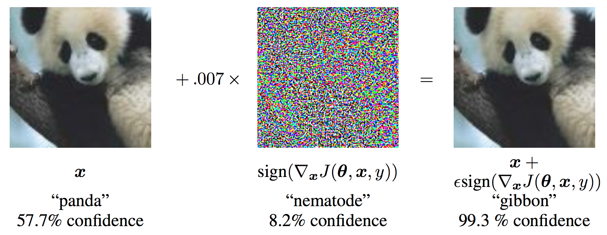

# Is attacking machine learning easier than defending it?

Feb 15, 2017
by Ian Goodfellow and Nicolas Papernot

在我们的第一篇博文中，我们展现了一些攻击者可以用来破坏现有的机器学习系统的方法，比如用学习算法 [BNL12] 在训练集中投毒，或者制造对抗样本来使模型做出错误的预测 [SZS13]。在这篇博文中，我们会拿攻击样本做例子，来说明为什么攻击机器学习看起来要比防御更简单。换句话说，我们会细致地介绍一些为什么我们仍然不能完全有效地防御攻击样本的原因，以及我们是否真的能奢求这样地防御。

一个攻击样本是针对某个个机器模型的输入，它经过了攻击者精心地设计，从而来糊弄这个模型使它产生错误的输出。举个例子，我们可以在一个熊猫的图片上加上一个精心计算过的小扰动来使得这个图片被以高置信度识别成长臂猿 [GSS14]:

如今，设计一些这样来愚弄模型的花招，要比设计出不被愚弄的模型简单多了。

# 我们如何试图让机器学习模型在对抗样本前面更鲁棒？

让我们来看看两种防御技巧：对抗训练和防御蒸馏，作为例子来看看一个防御方如何尝试使得机器学习模型更鲁棒以及减轻攻击样本的危害。

**对抗训练** 尝试通过主动在训练的时候生成对抗样本去提高模型在测试阶段的泛化性。这个想法是 Szegedy 等人 [SZS13] 首先提出的但是当时并不可行因为生成对抗样本的计算开销过高。Goodfellow 等人展示了如何通过快速梯度符号法来以低（计算）成本的方式生成对抗样本，并使训练过程中生成大批量的对抗样本变得计算高效 [GSS14]。然后把相同标签的对抗样本和原始样本分配给模型训练--举例来说，我们可能会拿一张猫的图片，对其进行对抗扰动来欺骗模型让它认为这是一个秃鹰，再告诉模型这还是应该被识别成一只猫。在 cleverhans 这个库中提供了对抗训练的一个开源实现，这个[教程](https://github.com/tensorflow/cleverhans/tree/master/examples)提供了它的用法。

**防御蒸馏** 使得对手利用的对抗方向中的模型的决策平面更平滑。蒸馏是一种通过一个模型来预测另一个更早的模型的概率化输出的训练过程中的步骤。蒸馏第一次是由 Hinton 等人提出 [HVD15]，当时目的是用一个小的模型来模拟一个大的，计算开销昂贵的模型。防御蒸馏有一个不同的目标：简单地使得最后的模型的反应更平滑从而能更好的奏效，即使模型间是一样的大小。训练一个模型来预测另一个有着相同架构的模型的输出也许看起来是有点有悖常理的。它奏效的原因是第一个模型是由“硬”标签训练的（100% 的概率一个图片是狗而不是猫）而第二个模型是用“软”标签（95% 的概率一个图片是个狗而不是猫）来训练的。第二个*蒸馏后*的模型在面对类似快速梯度信号 [PM16] 或以雅可比为基础的显著图 [PMW16] 更鲁棒。这两种攻击方法的实现同样可以在 [cleverhans](https://github.com/tensorflow/cleverhans) 中找到，参照[这里](https://github.com/tensorflow/cleverhans/blob/master/tests_tf/test_mnist_tutorial_tf.py)和[这里](https://github.com/tensorflow/cleverhans/blob/master/tests_tf/test_mnist_tutorial_jsma.py)。

# 一种失败的防御：gradient masking （梯度掩码）

大多数对抗样本构造技术通过模型的梯度来做攻击。简单地说，他们看着一张机场的照片的时候，他们测试这个图片空间中的哪个方向能使变成“猫”的概率增加，然后他们往那个方向稍微推动一下（换句话说，他们给输入一点扰动）。然后，这个修改后的图片被误认为是只猫。

但如果没有梯度的话呢？如果对图像的微调不能造成模型输出的改变呢？这看起来起到了一些防御的效果，因为攻击者不知道怎么去“推”这个图片了。

我们很容易就能想到一些简单的方法来去掉梯度。比如，大多数图片分类模型可以被分为这两种模式：输出最可能的类的标签和输出各个类别的概率。如果模型输出的是“99.9% 机场，1% 猫”，那么一点对于输入的小改变就能给输出带来小改变，于是梯度就会告诉我们那些改变可以带来在“猫”的概率上的增加。然而当我们使用的模型只是输出只有“飞机”这一个类别的话，那么输入的微调就一点也不会改变输出了，而梯度就不能给我们带来任何东西了。让我们来做一个思想实验，看看我们如何通过这个“最近类”而不是“概率模式”来让我们的模型防御对抗样本的。攻击者不再知道怎么找到能被分类成猫的输入，所以我们似乎取到了一些防御效果。然而不幸的是，之前那些被错分成猫的样本现在还是被分类成猫。如果攻击者能够猜到哪几个点是对抗样本的话，这些点仍然能导致错分类。我们并没有使得这个模型更鲁棒，我们只是给了攻击者更少的线索来弄清模型防御时的漏洞在哪。甚至更不幸的是，事实证明攻击者有一个非常好的策略来猜测防御的漏洞在哪。攻击者可以自己训练一个平滑的，有梯度的模型，然后生成对抗样本，再针对我们不平滑的模型部署这些对抗样本。很多时候，我们的模型也会把这些样本分错。最后，我们的思想实验表明隐藏掉梯度并没有什么用。

因此，我们把这个有缺陷的防御策略叫做 **gradient masking**，一个在 [PMG16] 中引用的术语。这种使用 **gradient masking** 的防御策略