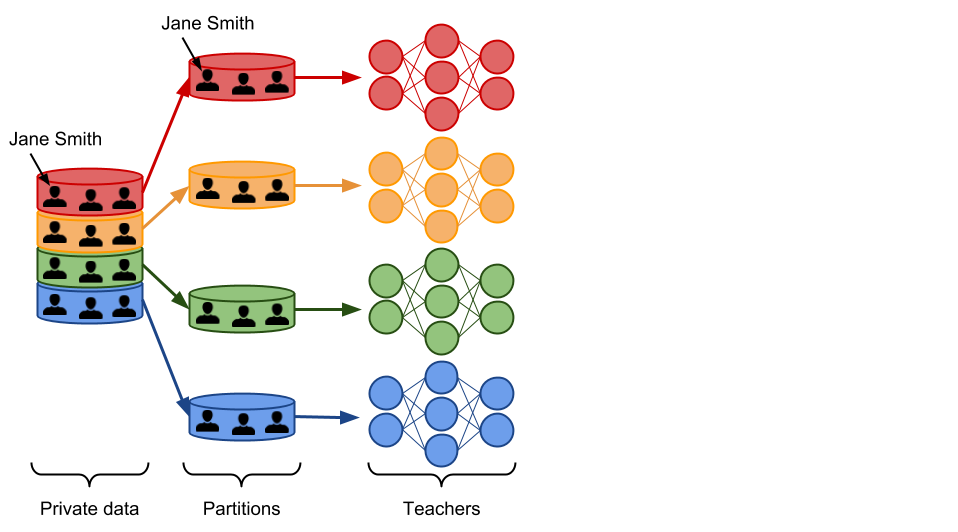
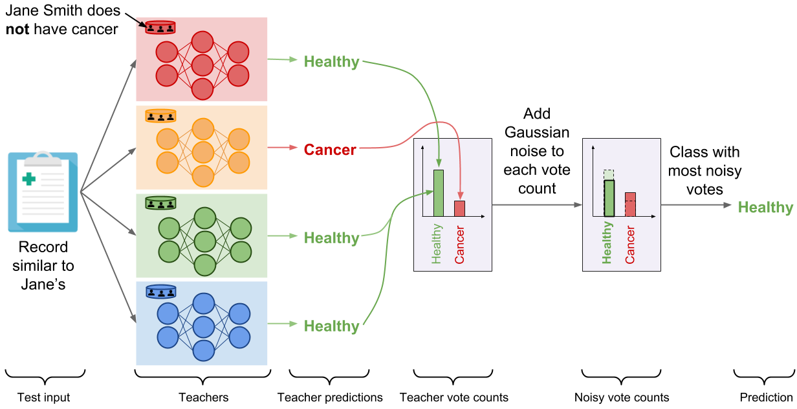
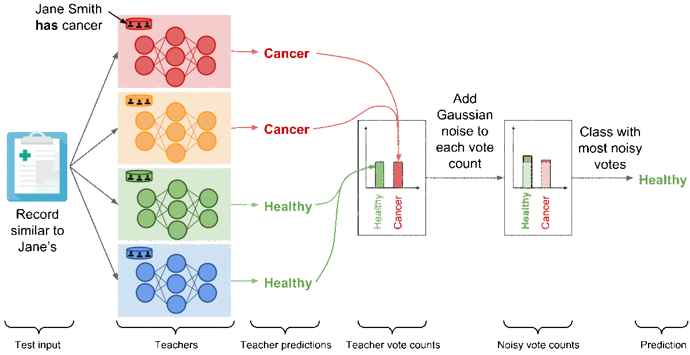

# Privacy and machine learning: two unexpected allies?

Apr 29, 2018

by Nicolas Papernot and Ian Goodfellow

在许多机器学习的应用中，比如将机器学习用于医疗诊断，我们都希望机器学习算法不要去记录训练集中的一些敏感信息，比如说一个患者个体特定的医疗历史。*差分隐私*就是这样一个框架来衡量一个算法提供的隐私保证。透过差分隐私，我们能够设计出机器学习算法，其能够可靠地在隐私数据上训练。我们（和 Martín Abadi, Úlfar Erlingsson, Ilya Mironov, Ananth Raghunathan, Shuang Song 以及 Kunal Talwar 一起） 在机器学习中的差分隐私上的工作，使得机器学习行业的研究者更容易在这个方向上做出贡献（即使是那些不精通差分隐私中的数学的人）。在这篇博文中，我们将展示怎么做到这一点。

最关键的一系列算法被命名为 Private Aggregation of Teacher Ensembles (PATE)。在 PATE 框架中的一个最重要的之处，除了它的名字外，就是每个知道怎么训练一个有监督机器学习模型（比如说一个神经网络）的人都能为机器学习上的差分隐私研究做出贡献。PATE 通过精心协调几个不同的机器学习模型的活动来实现隐私学习。只要你遵循 PATE 框架的的流程，整个模型结果就将有可量化的隐私保证。每个独立的机器模型都是用普通的有监督学习技巧训练的，而我们大多数读者可能已经对怎么攻击 ImageNet 的分类或其他传统的机器学习方向很熟悉了。

如有有人能够在 PATE 下为单个模型设计出更好的架构，或者说更好的训练算法，那么他们也能改进监督学习本身（并不只是个人的分类结果）。实际上，差分隐私可以被看成是一些从业者在普遍遇到的问题上的一个约束，即使在不要求差分隐私的设定下也是这样。这里面就包括过拟合。我们会在这篇博客中陈述在隐私和学习二者之前有趣的联系。特别的是，我们最近提出了扩展的 PATE，其改进了怎么协调不同的机器学习模型，从而能同时提高 PATE 框架得到的模型的准确性和隐私性。这表明了差分隐私的目标和学习模型的目标是一致的。

## 我们为什么需要隐私机器学习算法？

机器学习算法通过研究大量的数据来更新它的参数，并把数据间的关系编码到其中。理想情况下，我们希望这些机器学习的参数是以泛化的形式编码的（例如「吸烟的人更容易患心脏病」），而不是具体在一些特点的训练样本上（例如「Jane Smith」患有心脏病）。不幸的是，在默认情况下，机器学习模型并不会在学习的时候忽略这些（特定的）细节。如果我们希望用机器学习来解决一个重要的问题，比如说做一个癌症诊断模型，那么在我们发布那个机器学习模型的时候（例如，为全世界的医生做个开源的癌症诊断模型），我们也可能无意中透露了有关训练集的信息。恶意的攻击者可以通过检查已发布的模型来得到有关 Jane Smith 的隐私信息 [SSS17]。这就是为什么要提出差分隐私。

## 我们怎么定义和保证隐私？

科学家们已经提出了许多在分析数据的同时提供隐私保障的方法。比如，通过删除一些私人的详细信息，或者用随机的值来替代，都是在数据分析的时候很常用的数据匿名化方法。通常的一些匿名的细节例子包括电话号码和邮政编码。然而，数据匿名化优势并不足以保证隐私，且当攻击者能够得到一些相关的数据集的个体的辅助信息的时候，其能提供的隐私就大打折扣了。众所周知，由于这个原因，研究人员能够 依照个人在互联网电影数据库（IMDb)公开分析的电影评级，对 Netflix 奖的参与者发布的电影评级数据集进行去匿名化 [NS08]。如果 Jane Smith 在 Netflix 奖数据集为电影 A, B, C 打了相同的评级，而且在 IMDb 上公开，那么研究人员可以在两个数据集中把和 Jane 相对应的数据匹配起来。反过来说，这又给他们机会，让他能恢复出 Netflix 奖项中包含但不在 IMDb 中包含的评级。这个例子说明了定义和保障隐私是多么困难，因为攻击者能访问到的个体的信息的范围是很难估计的。

差分隐私是一个框架，其被用来评估那些设计得能保证隐私的机制。它由 Cynthia Dwork，Frank McSherry，Kobbi Nissim 和 Adam Smith [DMNS06] 发明，其解决了 k-anonymity 等先前的方法的许多局限性。差分隐私的基本思路是随机化部分「机制」的行为来提供隐私。在我们的例子里，所谓的「机制」通常指的是一种学习算法，但其实差分隐私框架适用于研究任何算法。

我们所使用的差分隐私的版本要求，在我们改动训练集中的一个训练样本的时候，所学习出来的参数的概率应该大致相同。这就意味着我们可以添加一个训练样本，减少一个训练样本，或者改变其中一个训练样本的的值。直观上感觉就是，一个单个的患者（Jane Smith）不会影响（模型）学习后的输入，因此那个患者的记录也就没被（模型）记录，从而他的隐私就得到了保证。在本文接下来的部分，我们把这个概率称为 privacy budget（隐私预算）。越小的 privacy budget 就对应着越大的隐私保证。

在上图中，如果攻击者不能分辨出答案是从有三个用户中的随机算法中产生的，还是从有两个用户的随机算法中产生的时候，我们也就实现了差分隐私。

## PATE 背后的直觉是啥？

我们的 PATE 方法为机器学习提供差分隐私的方式是建立在一个简单的直觉之上：如果两个不同的分类器，在没有相同的训练样本的两个不同的训练集上训练，但又能在一个新的输入样本上达成一致（有相同的预测），那么这个决策就不会泄漏关于任何一个训练样本中的相关信息。对于任何一个样本来说，无论是在训练中使用了它的模型还是在训练中没有使用它的模型，都作出了相同的结论，那有没有某个单个的训练样本就都不影响做决定（预测）。

假如说我们有两个在分开的数据上训练的模型。当他们在某个输入上有一致的输出的时候，看起来我们就可以公布它们的决策了。不幸的是，当他们不能取得一致的时候，就不清楚要怎么做了。我们不能分别公布每个模型的的类输出，因为每个模型预测的类可能泄漏训练数据中包含的一些隐私信息。举个例子，假如 Jane Smith 之对其中一个模型的训练数据做了贡献。如果这个模型对一个记录和 Jane 很相似的患者作出了有癌症的预测，而另一个模型的预测结果相反，这就暴露了 Jane 的隐私信息。这个简单的例子说明了为什么要在算法中添加随机性从而来确保它能提供有意义的隐私保障。

## PATE 是如何运转的？

现在让我们一步步地来看 PATE 是怎么在这种情况下建立起来，从隐私数据中进行可靠的学习的。在 PATE 中，我们把隐私数据分割成数据的子集。这些子集作为分区，各自所包含的数据不存在重叠。如果 Jane Smith 的记录在隐私数据集中，如果它就只存在于一个分区中。我们为所有的分区都训练一个机器学习模型，这个模型叫做教师模型。对教师模型的训练方式没有限制。这实际上是 PATE 的主要优势之一：它和用来创造教师模型的学习算法无关。所有教师模型都解决相同的机器学习任务，但是他们是独自训练的。也就是说，只有一个教师在训练的过程中分析了 Jane Smith 的记录。下图是这个框架的一部分示例。

我们现在有了一群独立训练出来的教师模型，但是没有任何的隐私保证。我们怎么使用这个集群来做出保证隐私的预测呢？在 PATE 里，我们聚合每个单独的教师模型所做的预测，并在上面加噪声，来构造一个共同的预测。我们统计每个类上教师的投票数，再在这个数量上加一些拉布拉斯噪声或高斯噪声。对差分隐私文献熟悉的读者应该会对 naisymax 机制有了解。当输入的两个类别从教师模型中得到相等（或近似相等）的票数的时候，噪声会保证又有最多投票数的类别将会是这两个类别中的随机的一个。而另一方面，如果大部分教师模型选择了一个类别，那么在投票结果中加早上不会改变那个类别获得最多的票数这个事实。这个巧妙的设置为加噪聚合机制的预测同时提供了准确性和隐私性，只要教师模型之间的共识度足够高。下图描绘的是教师模型之间共识度很高的情况：也就是向投票统计中添加噪声不会改变候选的标签的情况。

为了说的更清楚些，我们用一个二分类的医疗诊断任务来阐述聚合的过程，不过我们把此机制扩展到更多的类上。现在，我们来分析一下如果 Jane Smith 有癌症的话，这个机制输出的结果。红色的模型代表的是唯一的在有 Jane Smith 数据上训练出来的教师模型，它现在学习到了将和 Jane 相似的记录判断为患有癌症的患者，（对比上一张图）现在的结果是它现在把和 Jane 相似的测试输入改成了「患癌症」。现在有两个教师模型投给「患癌症」了而剩下的两个模型投给了「健康」。在这个设定下，添加到两个投票总数中的随机噪声，可以防止聚类的结果反映任何个体教师的投票情况，从而保护了隐私：加噪聚合输出等可能的是「健康」和「患癌症」。

从这个角度说，PATE 提供了一种可以看成差分隐私 API 的东西：由这种加噪聚合机制预测出来的每个标签都带有严格的差分隐私保证，其又限制了标记该输入的 privacy budget。在我们运行的例子中，我们可以 bound 住标签预测在我们训练的教师模型（比如包括 Jane Smith）上，受个体记录影响的概率。我们用 Moments Accountant [ACG16] 和 Renyi Differential Privacy [M17] 二者中的一种来计算这个 bound。通过每次查询的投票直方图，我们统计到聚合输出的概率会岁这个噪声的注入而改变。然后，我们在所有的查询中汇总此信息。在实践中，privacy budget 主要取决于各个教师模型的共识度以及添加噪声的多少。教师模型之间的共识度越高，比如大多数票都投给同一个班级，那么它支持的 privacy budget 就越小。在某个特定的点上，在统计教师分配的票数之前加入更大的噪声也会带来比较小的隐私预算。回顾一下，privacy budget 越小，对应的隐私保障就越强。

