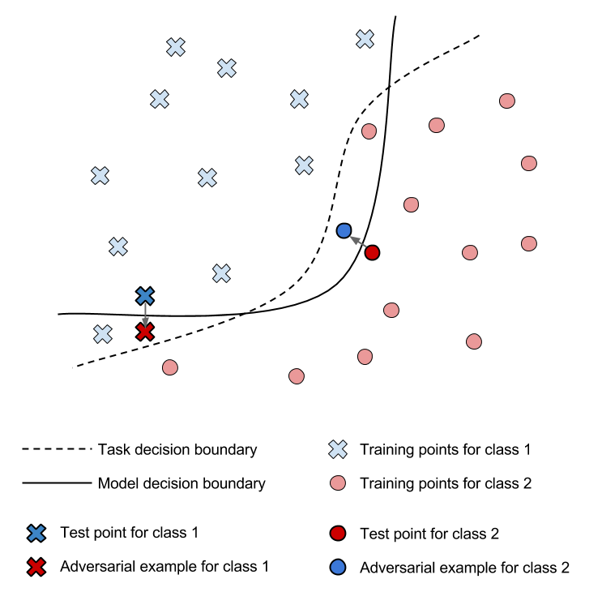

# Breaking things is easy

Dec 16, 2016

by Nicolas Papernot and Ian Goodfellow

直到一些年前，机器学习算法仍然在一些非常重要的任务上表现得不够好，比如检测物体和翻译。因此，那时一个机器学习算法表现得不好是常态，而不是例外。如今，机器学习算法已经发展到了下一个阶段：在一个自然发生（没有恶意加工）的输入的情况下，它可以做得比人类更好。但机器学习仍然没有达到真实人类的水平的状态，因为当面对即使是一个很微弱的攻击，许多机器学习算法都会显著地失效。换句话说，我们已经到了这么一个时刻点，机器学习能奏效，但也很脆弱。

这篇博客旨在介绍我们的新博客 -- Clever Hans，我们会在里面讨论所有攻击者可以用来破坏机器学习算法的方式。从学术上讲，我们的主题是**机器学习中的安全和隐私** [PMS16]。这个博客是由 Ian Goodfellow 和 Nicolas Papernot 联合维护。Ian 是 OpenAI 的一个研究科学家，而 Nicolas 是一个 Google Fellow Phd，就读于 Penn State University。我们一起创造了 cleverhans，它是一个开源的库，来校验一些机器学习的缺陷和攻击样例。这个博客给我们提供了一个平台，让我们能随意地分享一些关于机器学习安全和隐私的想法，而不是仅仅通过传统的学术著作，也可以分享一些关于 cleverhans 的消息和更新。

一个安全的系统必然是一个可被依赖的系统，并保证按预期的方式进行 [GSS03]。当我们尝试去为这个系统的行为背书的时候，我们会在心里考虑特定的攻击模型。这个攻击模型通常被定义成，一堆关于**希望让系统出错的攻击者的能力和目的**的假设。

到目前为止，绝大多数的机器学习模型都在在攻击模型很弱的条件下发展起来的，它们都没碰到过对手。机器学习模型系统被设计来应对自然的输入。如今，我们开始设计，在面对一个恶意的人甚至一个恶意的机器学习攻击者的时候，仍然能正确工作的机器学习系统。

举例来说，一个机器学习系统可能在训练（学习阶段）的时候或预测（推理阶段）的时候就已经被一个攻击者盯上了。攻击者也有不同程度的能力，其中可能包括访问模型内部（比如它的架构和参数），或者模型的输入和输出。

要攻击一个机器学习模型，一个攻击者可以去损害它的保密性（**confidentiality**），完整性（**integrity**）或可用性（**availability**）。这三者一起组成了安全中的 CIA 模型。

- 要提供保密性（**confidentiality**），一个机器学习系统必须不泄露任何信息给未认证的用户。在实践中，机器学习的保密性通常在隐私这个层面上意义更大：模型不能够泄露敏感的数据。举例来说，假设研究者建立了一个能够检查患者的医疗记录，并提供疾病诊断的机器学习模型。发布这样一个模型可以给医生提供宝贵的资源，但非常重要的一件事，是要确保一个恶意的人不能检查这个模型，并恢复出帮助训练模型的患者的个人医疗数据。
- 能够篡改模型完整性（**integrity**）的对手，可以通过改变它的预测结果，来让它变成完全不同的另一个样子。比如垃圾邮件的发送者可以尝试设计他们的邮件信息，来被错误地识别成合法邮件。
- 一个攻击者还可能损害一个系统的可用性（**availability**），例如在一个自动驾车汽车前面放置一些极其带有混淆性的物体，自动驾驶汽车可能会被迫进入故障安全模式并停车。

当然，到目前为止这些都是假设。而到目前为止安全研究员实际探索了哪种攻击呢？本博客后面的帖子会给出更多的例子，但是让我们先从这三点开始：训练期间的完整性攻击，推理期间的完整性攻击和隐私攻击。

## 训练集投毒

攻击者可能会通过修改现有的训练数据，或者在现有的训练集里插入额外的数据，来影响训练过程的完整性。举例来说，假设 Moriarty 教授希望将 Sherlock Holmes 陷害成一个罪犯。他可能会准备一个不引人怀疑的帮凶，来让 Sherlock 穿上一双非常独特和华丽的鞋子。而在 Sherlock 在他经常合作的警察面前穿上这些鞋子之后，警察就会把这双独特的鞋子和 Sherlock 联系起来。Moriarty 教授可能会穿着这双鞋子的拷贝版去参与犯罪，从而留下会让 Sherlock 陷入怀疑的痕迹。

在机器学习中，攻击者采取的策略是通过干扰训练样例，来增加机器学习在生产环境下预测时的犯错。举例来说，这种方法可以被用来污染支持向量机的训练集：用来衡量预测效果的损失函数具有凸的性质，使得攻击者能够精准地找到那些干扰它可以让模型效果影响最大的点 [BNL12]。而对如深度神经网络这种更加复杂，非凸的模型，找到有效的投毒点是仍待解决的问题。

## 用对抗样本来使模型犯错

事实上，搞破坏是如此的容易，攻击者都不需要通过分析机器学习模型学习的参数，来在训练集里下毒。代替的是，攻击者可以通过干扰模型预测（在模型完成训练后的推理阶段）时候的输入来立刻使模型犯错。

一个通常的寻找能使模型做出错误预测的扰动的方式是去计算对抗样本 [SZS13]。它们能产生非常细微及通常让人无法区分的扰动，但是却使机器学习模型产生错误的预测。举例来说，下面的插图是 [GSS14] 的复现，左边的图片能够正确地被机器学习模型分类成一个熊猫，但是加上了中间的噪声得到了右边相似的图形之后，这个模型就将它分类成了长臂猿。

注意，尽管这个扰动对人眼来说是不可区分的，但是它已经足够改变模型的预测结果。实际上，这个扰动是被构造得最小化输入的范数，又同时最大化模型的预测错误。这会有效地促使输入从原来正确的分类，跨过模型的决策边界从而变成错误的分类。对于二分类的问题，下面这张 2D 的图说明了这种现象。

许多基于对抗样本的攻击，要求攻击者必须知道机器学习模型参数的知识，从而来解决在输入扰动中的优化问题。相比之下，一些后续的工作考虑了，对那些只能通过观测对他们选的的输入产生的输出，从而来和模型交互的攻击者来说，更现实一些的攻击模型。例如，攻击者可以知道怎么设计网页，使得它在 Ia PageRank 机器学习模型中被排在前面，或者如何制作垃圾邮件来逃过检测。在这些黑盒的设置里，机器学习模型充当着 oracle 的角色。其中的一种策略是首先询问这个 oracle 来提取它的边界的近似值得到一个代替的模型，然后用这个提取出来的模型来制造会被 oracle 错分的对抗样本 [PMG16]。这是利用对抗样本迁移性的其中一种攻击：尽管这些模型的架构或训练数据不同，但是他们在解决相同的机器学习任务时经常犯同样的错。

## 机器学习中的隐私问题

机器学习中的隐私问题不一定涉及攻击者。举例来说，一个新兴的领域正在尝试解决学习算法在处理训练数据时的的不公平性和透明度。事实上，近来已经被提出，社会上的偏见已经渗入训练集中，然后又在学习中转化成了有偏见的模型预测。不过接下来，我们还是聚焦在有攻击者的场景。

攻击者的目的通常是恢复出部分用来学习这个模型的训练数据，或者用模型的预测结果来推测出用户一些敏感的属性。比如，智能手机键盘现在可以从用户的输入模式，来学习到更好的预测补全。然而，输入对一个用户来说特定的字符串，就不应该出现在其他的手机里，除非有足够多的用户也都输了这个字符串。因此，隐私攻击在推理预测阶段是相当需要被注意的，但是要削弱他们通常需要在学习算法中做一些随机化 [CMS11]。

例如，攻击者可能试图进行成员关系推理查询：判断一个特定的训练样例是不是被用来训练了模型。一篇最近的论文在深度神经网络的背景下考虑了这个问题 [SSS16]。和通过梯度来制作对抗样本（改变模型对正确答案的置信度）有点相反，成员关系推理攻击会通过梯度来寻找那些在分类的时候巨有非常高置信度的样例。它也可能可以从模型中推理出一些它的训练数据更泛化的统计信息 [AMS15]。

## 结论

现在是 2016 年 12 月。如今，我们知道许多种不同的方式来攻击机器学习模型的方式，以及极少的抵御方式。我们希望到了 2017 年 12 月，我们会有更多有效的抵御手段。这个博客的目的是推动机器学习中的安全和隐私的发展，通过记录取得的进步和激发研究者参与这些话题的讨论，以及鼓励新一代的研究人员加入这个社区。

## 致谢

谢谢 Catherine Olsson 指出我们 “常态，而不是例外” 在原来的博文上说反了，我们已经改正过来。

谢谢 Ryan Sheatsley 和 Vincent Tjeng 指出一处拼写错误。

## 参考文献

- [AMS15] Ateniese, G., Mancini, L. V., Spognardi, A., Villani, A., Vitali, D., & Felici, G. (2015). Hacking smart machines with smarter ones: How to extract meaningful data from machine learning classifiers. International Journal of Security and Networks, 10(3), 137-150.
- [BS16] Barocas, S., & Selbst, A. D. (2016). Big data’s disparate impact. California Law Review, 104.
- [BNL12] Biggio, B., Nelson, B., & Laskov, P. (2012). Poisoning attacks against support vector machines. arXiv preprint arXiv:1206.6389.
- [CMS11] Chaudhuri, K., Monteleoni, C., & Sarwate, A. D. (2011). Differentially private empirical risk minimization. Journal of Machine Learning Research, 12(Mar), 1069-1109. 
- [GSS03] Garfinkel, S., Spafford, G., & Schwartz, A. (2003). Practical UNIX and Internet security. O’Reilly Media, Inc.
- [GSS14] Goodfellow, I. J., Shlens, J., & Szegedy, C. (2014). Explaining and harnessing adversarial examples. arXiv preprint arXiv:1412.6572.
- [PMG16] Papernot, N., McDaniel, P., Goodfellow, I., Jha, S., Berkay Celik, Z., & Swami, A. (2016). Practical Black-Box Attacks against Deep Learning Systems using Adversarial Examples. arXiv preprint arXiv:1602.02697.
- [PMS16] Papernot, N., McDaniel, P., Sinha, A., & Wellman, M. (2016). Towards the Science of Security and Privacy in Machine Learning. arXiv preprint arXiv:1611.03814.
- [SSS16] Shokri, R., Stronati, M., & Shmatikov, V. (2016). Membership Inference Attacks against Machine Learning Models. arXiv preprint arXiv:1610.05820.
- [SZS13] Szegedy, C., Zaremba, W., Sutskever, I., Bruna, J., Erhan, D., Goodfellow, I., & Fergus, R. (2013). Intriguing properties of neural networks. arXiv preprint arXiv:1312.6199.